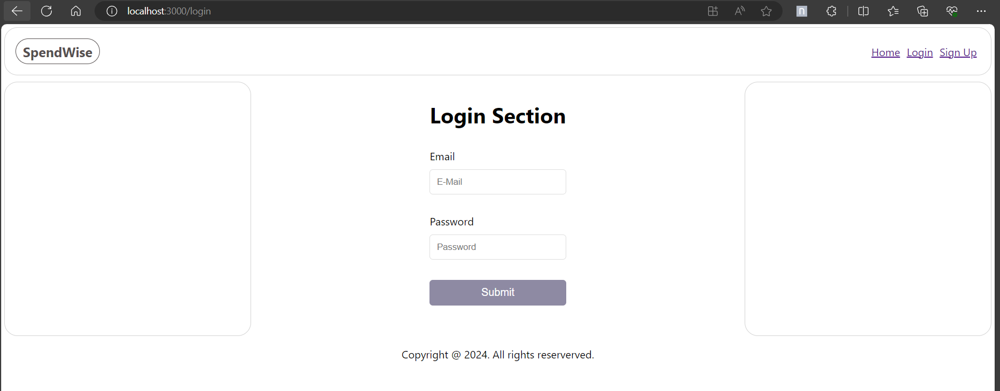

# SpendWise - Expense and Income Tracker

## Key Features

## App

The app is an expense tracker built using MERN (MongoDB, Express.js, React.js and Node.js) stack. It is a SPA (Single Page Application).
You can log your expenses and income of various cateries and see a breakup of those in a chart. A transaction history is also shown.



Once you have installed the code mentioned below you will be able to open the app in your browser with URL http://localhost:3000 If the installation goes well, browser should open this URL automatically. You would be redirected to the login page. For first time users, signup is needed.

### Feaures

#### Front end

- Uses React features such as hooks, context, router, JWT etc.
- AuthContext for login/logout
- React Router to mimic various pages in the URL
- GlobalContext for storing transactions data and sharing accross the components
- LocalStorage for data persistence
- JWT (json web token) for authentication with backend.
- Graphical representation of expense/income categories using Charts and ApexCharts
- Responsive for desktop as well as mobile phone viewports
- Basic HTML form validation
- Autosuggestion of categories
- Tested to work fine on Edge and Chrome.

#### Back end

- Uses Node.js, Express.js and MongoDB
- Express for,
  - various APIs,
  - Authentication with JWT,
  - Middlewares,
  - Validators,
  - Routes,
  - Models,
  - Controllers,
  - API versioning
- MongoDB to store transactions and user details in a nosql database.

## How To Install and Use The App

To clone and run this application, you'll need and [Node.js](https://nodejs.org/en/download/) (which comes with [npm](http://npmjs.com)) installed on your computer. Once node.js is installed follow the below steps.

Create an account on MongoDB Atlas and copy the connection URL.

From your command line (or vscode terminal) run these, in the order secified:

```bash
# Clone this repository
$ git clone https://github.com/pradkr/spendwise-mern-stack

# Go into the repository
$ cd server

# Make an environement file with name ".env" and copy-paste following in it,
#NODE_ENV=development
#PORT=5000
#REACT_APP_MONGODB_URL=mongodb+srv://<your-user-password>@test.1qgfrhh.mongodb.net/?retryWrites=true&w=majority
#SECRETCODE=your_secret_string_use_special_chars_numbers_letters_atleast_6_chars_long
#HOST=http://localhost
#HOST_BE=http://localhost

# Install dependencies
$ npm install

# Run the backend server
$ npm run start


# Above command should start a server and connect to DB (should say "Success: Connected to MongoDB host ac-***********.mongodb.net" in the terminal). If not connected to mongoDB, do not proceed.

# Open another terminal to run the app server
$ cd app

# Open package.json and make sure proxy is added at the bottom of this file.
# If not, add proxy to your react app package.json, as last line
#    ]
#  },
#  "proxy": "http://localhost:5000"
#}

# Install dependencies
$ npm install

# Run the app
$ npm run start

```

## Deployment

For production deployment, Build the React App and then the build folder has to be copied to server folder. This will enable us run the App static files on the root "/" from the same deployment server. If you intend to keep frontend on one server and backend on another, skip this step.

```bash
# In App folder, Build the app,
$ npm run build
```

> **Note**
> If you're using Linux Bash for Windows, [see this guide](https://www.howtogeek.com/261575/how-to-run-graphical-linux-desktop-applications-from-windows-10s-bash-shell/) or use `node` from the command prompt.
